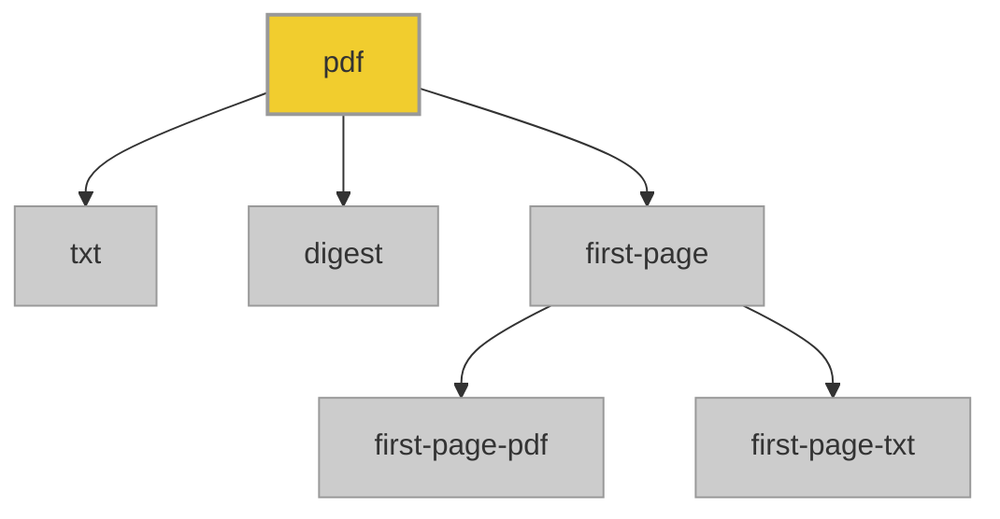

#  Contributing

This repository holds the PDF corpus used for testing borb. Contributions help maintain a diverse, high-quality set of PDFs for automated testing.

Important: Users should not manually add PDFs to the repository. All PDF additions must go through the provided Python script, which:

- Organizes PDFs into the correct directories
- Checks for duplicates via SHA256 digest
- Generates auxiliary files such as text extracts and first-page PDFs

## Table of Contents

- Using the PDF Processing Script
- File Organization
- Naming and Metadata
- Scripts and Code Rules
- Code of Conduct

## Using the PDF Processing Script

To add new PDFs:

1. Place your PDF(s) in the source directory defined in the script (SRC_DIR).
2. Run the processing script:

```cmd
python process_pdfs.py
```

The script will:

- Check for duplicate PDFs using SHA256 digests
- Copy PDFs to the main pdf/ directory with sequential numbering
- Generate:
  - Full-text `.txt` files
  - First-page PDF files in `first-page-pdf/`
  - First-page text extracts in `first-page-txt/`
  - Update digest files in `digest/`

Do not bypass the script or manually move PDFs, as this may break corpus consistency.

## File Organization



- `pdf/` – Full PDFs
- `txt/` – Full-text extracts
- `first-page-pdf/` – PDFs containing only the first page
- `first-page-txt/` – Text extract of the first page
- `digest/` – SHA256 digests of all PDFs to detect duplicates

## Naming and Metadata

Filenames are automatically generated (`0001.pdf`, `0002.pdf`, …). 

## Scripts and Code Rules

If contributing or updating scripts:

- Use `black` for formatting
- Use `mypy` for type checking
- Include docstrings and minimal tests when appropriate

## Code of Conduct

By contributing, you agree to follow the Contributor Code of Conduct.  
